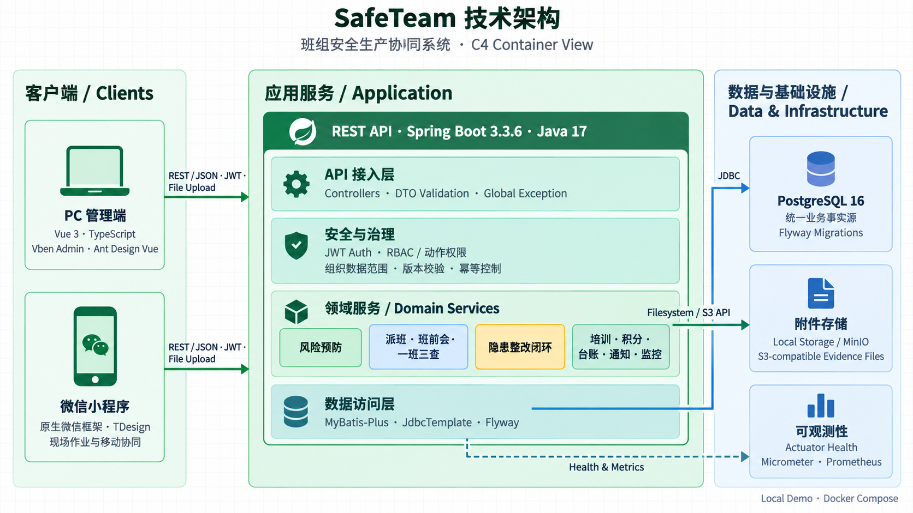
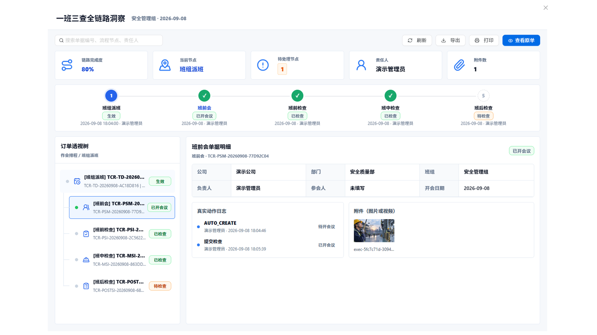
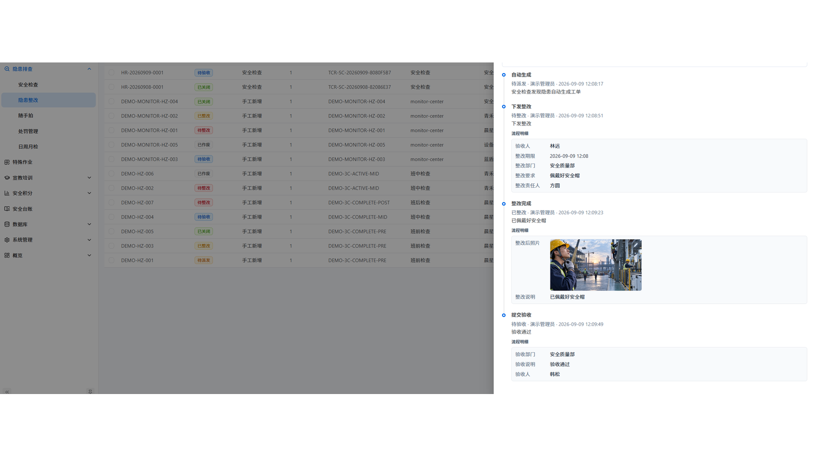
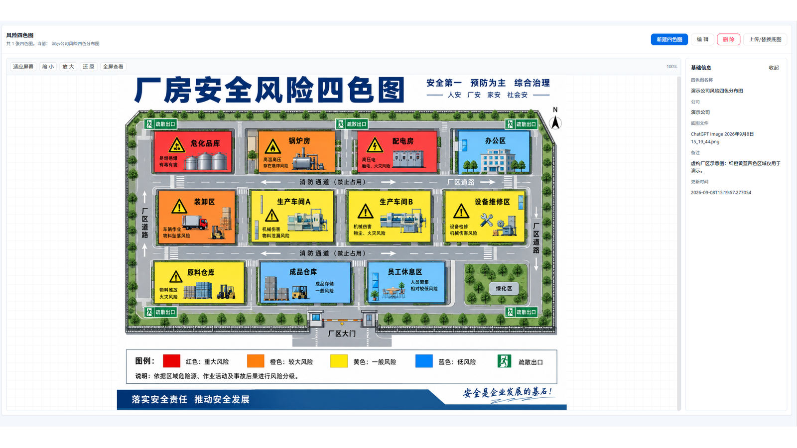
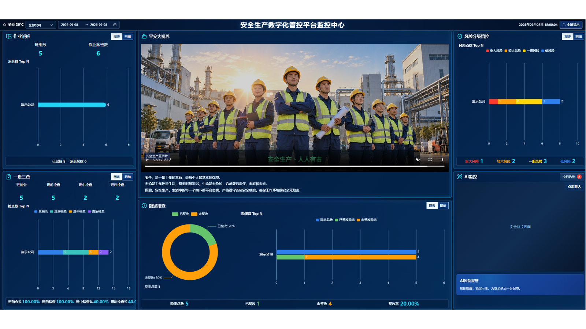
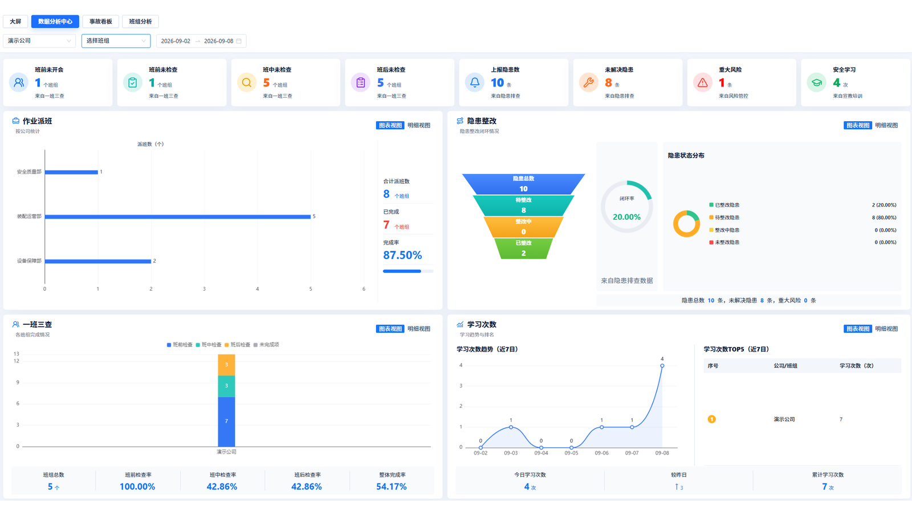
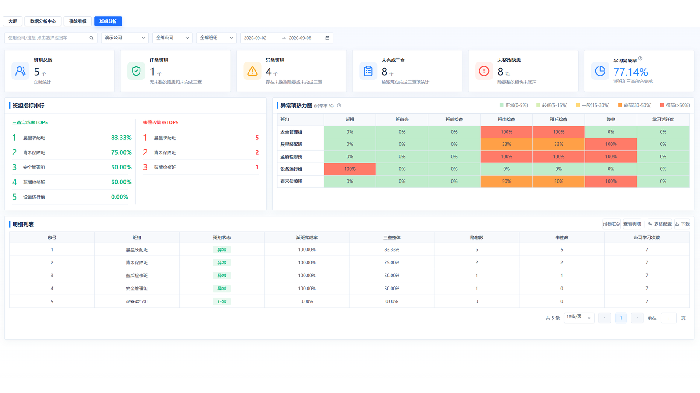

# SafeFlow - 安全生产数字化管控平台

[概述](#-概述) · [架构](#-架构) · [功能概述](#-功能概述) · [快速开始](#-快速开始)

## 📌 概述

SafeFlow是一套面向高风险作业场景、覆盖 PC 管理端与微信小程序的班组安全协同系统，通过统一的数据链路连接风险预防、现场作业、隐患整改与安全运营。

平台围绕四类核心能力构建：

- **风险预防**：维护风险点、风险等级与管控措施，在作业开始前识别重点风险。
- **现场执行**：通过派班、班前会及班前、班中、班后检查组织一次完整作业过程。
- **隐患闭环**：将发现的问题转为可派发、可整改、可举证、可验收的隐患工单。
- **安全运营**：通过监控分析、培训考试、积分、安全台账与消息通知支持日常管理。

## 🏗️ 架构



核心业务约束由服务端统一执行。前端负责呈现可用操作，后端负责检查用户权限、组织数据范围、当前状态、请求版本和幂等标识，避免仅依赖页面按钮控制流程。

## 🧩 功能概述

### 一班三查｜班组作业全过程

**核心机制：** 以一次班组派班作为业务主线，关联班前会、班前检查、班中检查和班后检查。全链路视图统一聚合节点状态、当前待办、责任人、关联单据、现场附件和操作日志。

**执行流程：** `班组派班 → 班前会与安全交底 → 班前检查 → 班中检查 → 班后检查`

**异常分支：** 任一检查节点发现问题时，可生成隐患记录并进入整改闭环；未完成节点持续保留为待办，便于管理人员定位中断位置和责任人。

**工程亮点：** 后端按派班聚合五个业务阶段，避免前端拼接多套孤立数据；状态历史、附件和关联单据共同构成可追溯的作业证据链。



### 隐患整改｜隐患治理完整闭环

**核心机制：** 将检查或随手拍发现的问题转化为隐患工单，记录隐患来源、风险等级、整改部门、整改责任人、整改期限和整改要求。整改与验收由不同业务动作驱动，“已整改”不会直接等同于“已关闭”。

**执行流程：** `发现隐患 → 创建工单 → 下发整改 → 完成整改并上传证据 → 提交验收 → 验收通过后关闭`

**异常分支：** 验收不通过时，工单退回待整改阶段重新处理；未关闭工单可根据权限作废，非法状态动作由后端拒绝。

**工程亮点：** 使用显式状态机约束流转，并结合动作权限、组织数据范围、版本校验、幂等标识、附件和流转日志保护业务一致性与责任追溯。



### 风险预防｜结构化风险台账与四色图

**核心机制：** 以结构化风险点为基础，统一维护风险等级、责任组织和管控措施，并将重大、较大、一般、低风险映射为红、橙、黄、蓝四种颜色，形成按企业组织展示的区域风险视图。

**管理对象：** 风险点、风险等级、责任组织、管控措施、四色图底图及说明。

**更新机制：** 风险等级、区域信息或厂区布局发生变化后，重新评定风险并更新对应四色图；底图失效时可上传新版本替换。

**工程亮点：** 风险清单与可视化底图分离维护，结构化数据用于查询和统计，四色图用于现场风险呈现，兼顾数据可计算性与业务可读性。



### 安全运营｜从企业概览到班组下钻

#### 监控中心｜一屏掌握当前安全态势

**核心机制：** 在一张大屏中聚合作业派班、一班三查、风险分级和隐患整改数据，统一展示派班数量、阶段检查完成率、风险等级分布、隐患总数及整改率，并支持按企业和日期范围筛选。

**关键指标：** 派班数量与完成情况、班前/班中/班后检查完成率、四级风险分布、隐患总数、已整改数量和整改率。

**分析价值：** 将未完成检查、重大风险和未整改隐患集中呈现在同一视图中，并支持从图表切换到明细，帮助管理人员优先处理当前待办。

**工程亮点：** 指标按企业和时间条件从派班、检查、风险和隐患源数据动态聚合，不单独维护重复统计结果，降低业务数据与大屏指标不一致的风险。



#### 数据分析中心｜从汇总指标追踪业务趋势

**核心机制：** 从组织、时间和业务模块三个维度分析派班执行、三查完成、隐患闭环和安全学习情况，通过指标卡、趋势图、完成率、隐患整改漏斗和排行榜呈现结果。

**关键指标：** 派班完成率、三查分阶段完成率、隐患状态分布与闭环率、安全学习次数及近期变化趋势。

**分析价值：** 通过时间趋势和整改漏斗判断问题集中在哪个阶段，并切换明细追踪未完成记录、未解决隐患或低活跃组织，而不只停留在当前总数。

**工程亮点：** 使用统一的组织和时间筛选条件驱动多业务指标聚合，使不同图表保持相同统计口径，并同时提供图表视图与明细视图。



#### 班组分析｜识别异常班组并下钻明细

**核心机制：** 对班组派班完成率、三查整体完成率、未整改隐患和学习活跃度进行横向比较，通过指标排名、异常项热力图和明细列表区分正常与异常班组。

**关键指标：** 班组派班完成率、三查整体完成率、未整改隐患数量、学习活跃度、异常项数量和平均完成率。

**分析价值：** 通过排名和热力图识别存在未完成三查或未整改隐患的班组，再下钻查看具体指标与业务明细，为班组督导提供定位依据。

**工程亮点：** 将多个业务域的结果统一映射到班组维度，形成可比较的运营视图，同时保留计算口径说明、指标明细和导出入口，便于从汇总结论回溯原始记录。



#### 扩展运营能力

| 能力 | 主要内容 |
| --- | --- |
| 特殊作业 | 管理作业登记、安全交底、审批、执行跟踪与验收 |
| 培训考试 | 管理学习内容、考试任务、在线答题与考试成绩 |
| 安全积分 | 记录积分流水并形成个人与班组排名 |
| 安全台账 | 统一管理制度、规程、计划、方案及业务记录 |
| 消息通知 | 提供业务通知、待办提醒、公告及已读状态管理 |
| 组织权限 | 管理公司、部门、班组、人员、角色及数据范围 |

### 平台级工程能力

- **组织数据范围**：按用户所属企业、部门和班组过滤业务数据，避免跨组织读取无权限记录。
- **动作级权限**：将“查看页面”和“执行派发、整改、验收等业务动作”分开授权，由服务端进行最终校验。
- **状态与变更历史**：记录单据状态日志及关键字段变化，支持从当前结果回溯处理过程。
- **幂等与版本校验**：降低跨端重复提交、重复创建和旧版本请求覆盖新数据的风险。
- **统一附件生命周期**：将检查照片、整改前后材料和业务文件关联到对应单据，并兼容本地存储与 MinIO。

## 🚀 快速开始

运行环境：JDK 17、Docker Compose v2、Node.js 22、Corepack / pnpm；微信小程序调试需安装微信开发者工具。首次运行前，请复制 `.env.portfolio-demo.example` 为 `.env.portfolio-demo`，填入本地数据库、对象存储和 JWT 配置，再按下方命令启动 Demo。`docs/` 目录仅作为本地开发资料保留，不随仓库发布。

### PC Web

```powershell
# 启动 PostgreSQL 与后端
docker compose -f docker-compose.storage.yml up -d postgres
./mvnw.cmd -f backend/pom.xml spring-boot:run "-Dspring-boot.run.profiles=local" "-Dspring-boot.run.arguments=--server.port=28080"

# 在另一个已加载 .env 的终端初始化本地 Demo 账号
./scripts/init-demo.ps1 -ConfirmDemo

# 启动 PC 管理端
Set-Location vben
corepack enable
pnpm install --frozen-lockfile
Copy-Item apps/web-antd/.env.development.example apps/web-antd/.env.development
pnpm -F @vben/web-antd run dev
```

访问 `http://127.0.0.1:15666`，使用 `portfolio-admin` 和初始化脚本生成的随机密码登录。

### 微信小程序

```powershell
Set-Location mini-program
npm install
npm test
```

在微信开发者工具中导入仓库根目录，填写本地 AppID，执行“工具 → 构建 npm”，并根据后端地址调整 `mini-program/config/env.js`。
